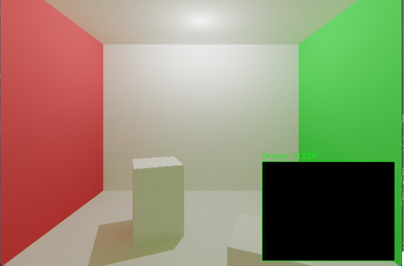
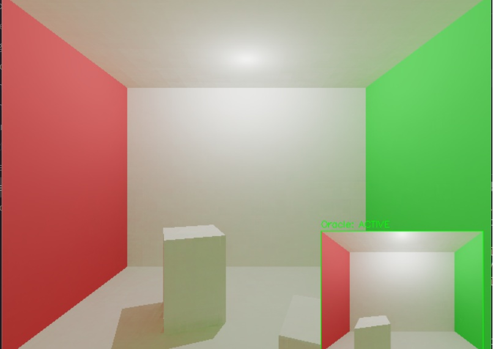

# Predictive Neural Radiance Caching

### TL;DR
- Reframes global illumination as a regression problem using an MLP to predict indirect lighting.
- Achieves real-time performance (~60 FPS) with dynamic scenes and camera movement.
- Predictive "oracle" training improves stability by learning from extrapolated future camera states.

### Demo


*Current Frame (Predicted Lighting)*


*Oracle / Future Prediction (Lookahead Training Signal)*

### Key Idea
The system treats global illumination as a spatial regression problem. Instead of performing expensive multi-bounce ray tracing per pixel, a shallow MLP accelerated by multi-resolution hash grid encoding learns to predict the indirect radiance field. By integrating a predictive oracle that extrapolates camera motion, the network pre-trains on upcoming views, effectively mitigating the temporal lag typically seen in online-trained radiance caches.

### Results
- **Performance:** Reduced average frame time from ~26ms to ~11ms (~2.3x speedup).
- **Framerate:** Stable ~60 FPS on GPU.
- **Stability:** High temporal coherence during rapid camera translation and rotation.

### How it Works
1.  **Direct Rendering:** Execute primary ray tracing and compute analytical direct lighting.
2.  **Neural Inference:** Query the Hash-MLP for the indirect radiance component at primary hit locations.
3.  **Bootstrap Training:** Sample random secondary rays to generate ground-truth radiance targets for online optimization.
4.  **Predictive Oracle:** Extrapolate camera trajectory to generate future-view rays, populating the cache before the viewport arrives.

### Running the Project
```bash
pip install -r requirements.txt
python main.py
```
*Controls: WASD for movement, Q/E for rotation, ESC to quit.*

### Key Insight
Learning-based rendering can replace expensive stochastic computation in real-time systems by reframing radiance estimation as a regression task. A predictive training loop is the primary mechanism for maintaining visual stability under motion.
